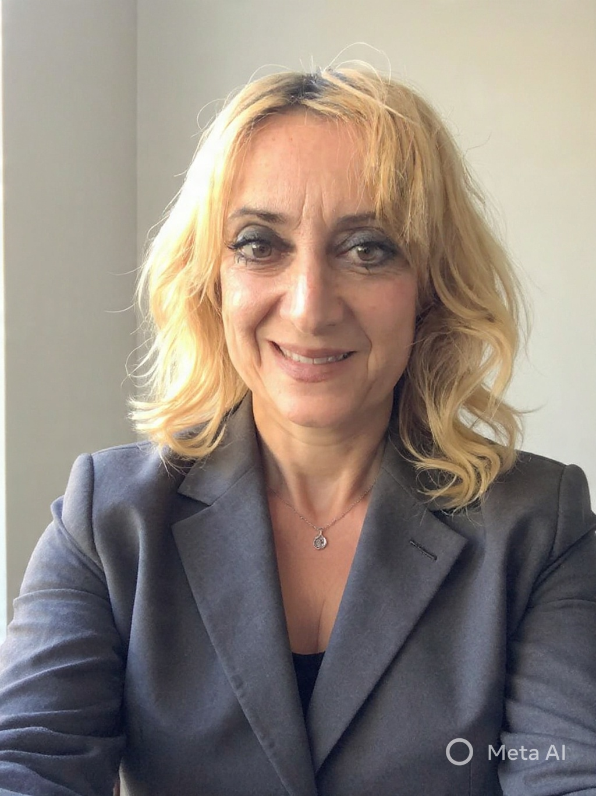

:::callout-note

The [Rome R Users Group](https://www.meetup.com/rome-r-users-group) was founded in 2025 by [Federica Gazzelloni](https://federicagazzelloni.com/) to connect and support R users, data scientists, and enthusiasts across Rome.

:::

## 

::: columns
::: {.column width="58%"}
[Federica Gazzelloni](https://federicagazzelloni.com/) Lead Organizer - from Rome. I am an independent researcher passionate about data science, with a background in actuarial statistics and expertise in collaborative environments. My journey extends from traditional actuarial work to advanced data science with R. As the lead organizer of R-Ladies Rome and Rome R Users Group, I advocate for inclusivity and knowledge-sharing, hosting various events promoting the R language but not limited to. I am also a book club facilitator with the DSLC (former R4DS) online community, fostering collaborative learning. Additionally, I have contributed as a reviewer to global health initiatives, emphasizing accessible learning and effective communication. (May 2025 to Present)
:::

::: {.column width="4%"}
:::

::: {.column width="38%"}

:::
:::

##

## Contact Us

To get in touch with [Rome R Users Group](https://www.meetup.com/rome-r-users-group/), you can email us at [romerusersgroup@gmail.com](mailto:romerusersgroup@gmail.com){.email}

## Code of Conduct

We have a [code of conduct](https://r-consortium.org/codeofconduct.html) that all members and participants are expected to follow. The code of conduct is designed to ensure that our community is a safe and welcoming space for everyone. We take any violations of the code of conduct seriously and will take appropriate action to address them.

