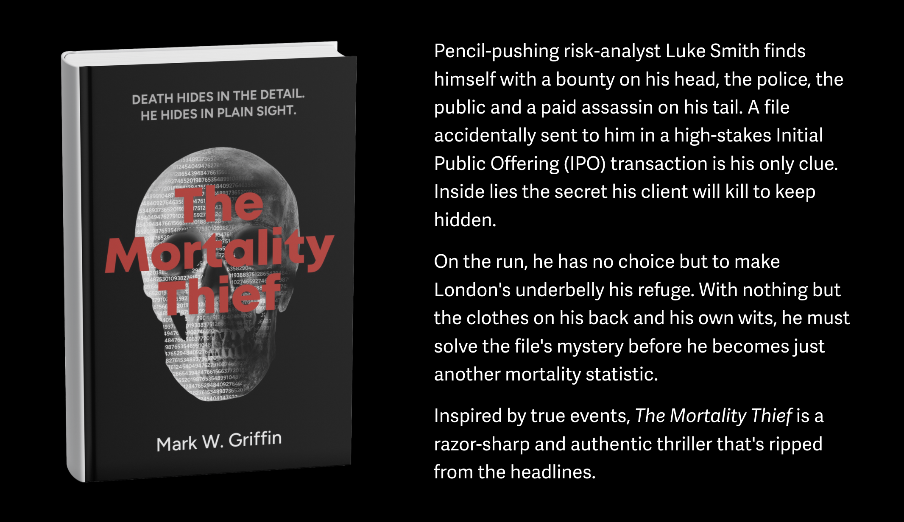
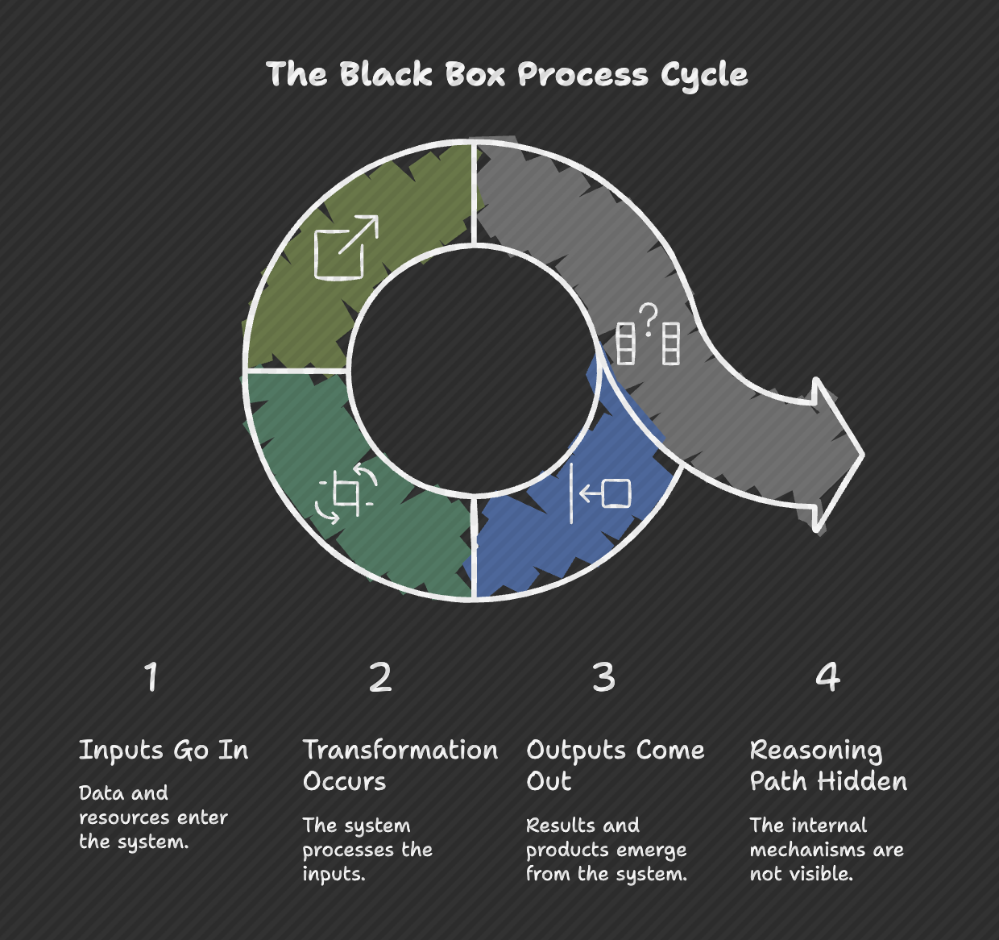

On February 26, 2026, the **Rome R Users Group** hosted **The Mortality Thief: Death Hides in the Detail**, a conversation with former actuary and risk executive [Mark Griffin](https://www.linkedin.com/in/markwgriffin/) on the intersection of risk management, AI, and storytelling. The session explored how actuarial thinking, model governance, and professional judgment shape both real-world decisions and the narrative behind his financial thriller.

{width=80%}

## When trust in data becomes the real risk

> What happens when the systems we trust most are the ones we should question the most?

This question sat at the center of the conversation, the discussion moved naturally between professional practice and storytelling, showing how risk thinking, governance failures, and emerging AI tools are deeply connected.

Rather than a book talk, the session became something more interesting: a reflection on how risk professionals think, how technology changes judgment, and what skills remain essential in an AI-driven world.

## The CRO mindset: thinking about failure for a living

Mark described risk management in very simple terms: **you are paid to think about what can go wrong.**

This involves technical analysis, but also something less formal — understanding behaviour. Risk often emerges not from mathematics alone, but from incentives, pressure, and human decisions under stress. In that sense, a thriller plot is not very different from a risk scenario analysis. The difference is that in fiction, one scenario actually happens.

This perspective explains why many risk professionals naturally become strong storytellers: they are already trained to think in narratives of cause and consequence.

## When systems become "gospel": the Post Office lesson

A major reference point in the discussion was the UK Post Office Horizon scandal, which Mark described as a perfect case study in model governance failure.

The core lesson is simple and uncomfortable: the system was trusted more than the people using it. When software outputs are treated as unquestionable truth, organisations stop asking the most important question in risk management:

*What if the model is wrong?*

This is not a technology failure alone. It is a governance failure. Models rarely fail silently — organisations fail when they stop questioning them.

## AI and the disappearing apprenticeship model

One of the most thought-provoking ideas discussed was how AI may change how professionals learn their craft.

Traditionally, junior analysts and risk managers learned the business by:

- collecting fragmented data
- reconciling inconsistencies
- talking to departments
- understanding how systems actually work

This process was slow, but it built intuition. If AI begins to automatically gather and connect all this information, an important question emerges:

**"How will future professionals build judgment if they skip the stage where judgment is formed?"**

Efficiency may remove friction, but friction was often where learning happened.

## From transparent models to black boxes

A particularly interesting contrast emerged between traditional tools like Excel and modern AI systems.

Excel, despite its limitations, has one powerful feature: visibility. You can inspect formulas, trace logic, and audit assumptions.

AI systems often move in the opposite direction:

- inputs go in,
- outputs come out,
- but the reasoning path is hidden.

{width=80%}

This does not make AI wrong. But it changes the role of the professional using it. The challenge is no longer just calculation. It becomes interpretation.

## The enduring importance of the "smell test"

Perhaps the most important idea from the session was what Mark called the *"smell test"*.

As tools become more sophisticated, technical skill alone is not enough. Professionals must develop the ability to recognize when a result is technically correct but contextually wrong.

This is where mathematical literacy, statistical thinking, and domain knowledge remain essential. Whether working in R, Python, or AI systems, the role of the analyst increasingly becomes: **not just producing answers, but validating reality**.

In this sense, the actuary or data scientist becomes a guardian of interpretation rather than just a producer of models.

## From mortality risk to climate risk

Looking ahead, Mark shared that his next work will focus on **climate risk** and the **economic transition to a greener economy**. Rather than focusing on catastrophe narratives, the interest lies in transition risk — *how systems, institutions, and individuals respond to structural change*.

This reflects a broader evolution in risk thinking: the biggest risks today are often not sudden shocks, but slow transformations.

## Final reflection

If there was one quiet conclusion from the discussion, it was this:

Technology will continue to change how we work. But judgment remains a human responsibility. The real professional advantage in the coming years may not be knowing more tools, but developing stronger reasoning.

## Watch the full conversation

The full discussion with Mark Griffin, with contributions from Mary Pat Campbell, is available on the Rome R Users Group channel.

## 🎥 Recording

🎬 Watch the Recording



More community events and discussions can be found through the Rome R Users Group Meetup page.

## 📦 Resources & Materials

- Intro presentation: https://tinyurl.com/4nrm2ren
- Mark Griffin LinkedIn: https://www.linkedin.com/in/markwgriffin/
- Mark Griffin website: https://www.markwgriffin.com/
- UK Post Office Horizon IT scandal (background): https://en.wikipedia.org/wiki/British_Post_Office_scandal

