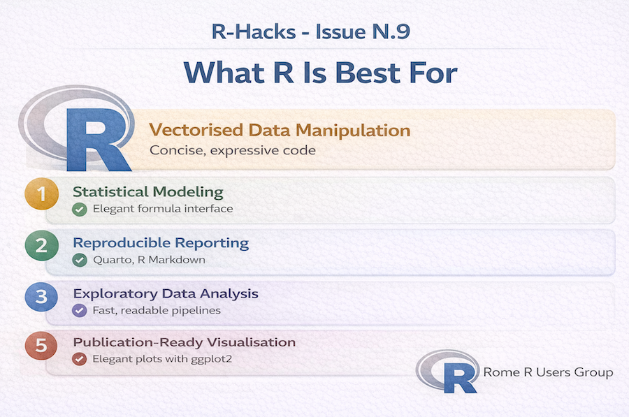

<br>

{width="80%" fig-align="center" fig-alt="ChatGPT generated image"}


The question is not:

> "Is R better than Python?"

The better question is:

> "What is R best for?"

:::{.callout-note}

Every tool has strengths.

:::

#### The value of R appears clearly when you focus on its design philosophy.


## 1️⃣ Vectorised Data Manipulation

In R, most operations are naturally vectorised.

```{r}
mean(df$col)
df$col > 100
df$new_col <- df$col * 2
```


No explicit loops required.

This makes analytical code:

- concise
- expressive
- readable

R was built for data first — not as a general-purpose programming language.


## 2️⃣ Statistical Modeling (Out of the Box)

R was designed for statistics.

### Modeling syntax is natural:

```{r}
model <- lm(y ~ x1 + x2, data = df)
summary(model)
```


Compare this to lower-level implementations elsewhere.

R’s formula interface is still one of the most elegant modeling abstractions available.


## 3️⃣ Reproducible Reporting

R integrates seamlessly with:

- Quarto
- R Markdown
- parameterised reports
- dynamic documents

You can move from:

::: {.callout-tip}

data → model → visual → report

:::

in one environment.

Few ecosystems make this as smooth.


## 4️⃣ Exploratory Data Analysis

R encourages rapid iteration:

```{r}
df |>
  group_by(group) |>
  summarise(mean_value = mean(value))
```


The tidyverse philosophy makes analytical transformations readable and composable.

For exploratory statistics, this is powerful.


## 5️⃣ Publication-Ready Visualisation

`{ggplot2}` remains one of the most coherent grammar-based plotting systems.

```{r}
ggplot(df, aes(x, y)) +
  geom_point() +
  theme_minimal()
```


Layered, declarative, expressive.


## 6️⃣ Where R Is Not Always Best

R may not be the best choice for:

- large-scale production APIs
- full-stack applications
- system-level programming

And that’s fine.

Tools should be chosen by purpose, not ideology.


## The Practical Conclusion

If your work is:

- statistical
- analytical
- exploratory
- report-driven
- reproducible

R is still one of the most efficient tools available.

Not because it replaces everything.

But because it was designed for analysis.


:::{.callout-note appearance=“simple”}
In Short

- R excels at statistics and modeling
- R is expressive for analytical workflows
- R integrates naturally with reporting
- R remains extremely strong for EDA and visualisation
- Choose tools based on task, not trend
:::

R does not need to compete with everything.

It just needs to do what it does best.

::: callout-tip
If you want to stay up to date with the latest events and posts from the Rome R Users Group:

👉 <https://www.meetup.com/rome-r-users-group/>
:::


