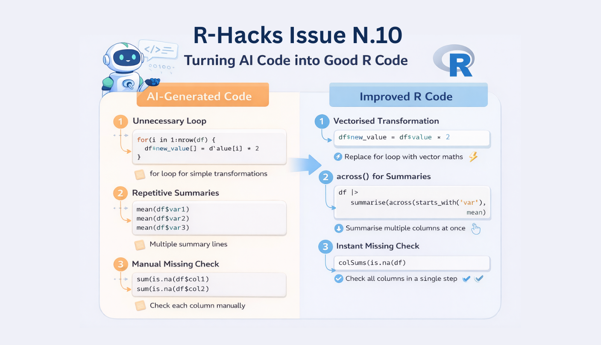

<br>

{width="80%" fig-align="center" fig-alt="ChatGPT generated image"}

> [**AI tools can now generate R code in seconds.**]{.underline}

Describe a task and a full script appears. For many analysts, this is quickly becoming part of the normal workflow.

::: callout-note
The first version of AI-generated code usually works, but it is often verbose, repetitive, or not very idiomatic.
:::

Just small improvements can turn that code into something clearer, shorter, and easier to maintain.

This issue of **R-Hacks** highlights a few compact patterns that experienced R users apply almost automatically. They are not advanced tricks, just small habits that help refine [**AI-generated scripts**]{.underline} quickly.

## 1️⃣ Replace Loops with Vectorised Operations

AI tools sometimes produce loops for simple transformations.

```{r}
for(i in 1:nrow(df)) { 
  df$new_value[i] <- df$value\[i\] \* 2 
  }
```

In R, this can usually be written in a vectorised way:

```{r}
df$new_value <- df$value \* 2
```

Vectorised operations are:

- faster 
- easier to read 
- less error-prone

They also reflect how R was designed to work with data.

## 2️⃣ Replace Repetitive Summaries with across()

AI code often repeats the same operation across multiple variables.

```{r}
mean(df$var1, na.rm = TRUE)
mean(df$var2, na.rm = TRUE) 
mean(df$var3, na.rm = TRUE)
```

A more compact approach:

```{r}
df |> summarise(
  across(starts_with("var"), 
  mean, na.rm = TRUE)
  )
```

This pattern: 

- reduces repetition 
- keeps scripts shorter 
- scales easily to many variables

## 3️⃣ Check Missing Values Instantly

AI rarely checks data quality unless explicitly asked.

A quick diagnostic:

```{r}
colSums(is.na(df))
```

This immediately reveals: 

- which columns contain missing values 
- how many observations are affected 
- where cleaning may be needed

It is a simple check that prevents many downstream issues.

## 4️⃣ Verify Transformations with Quick Size Checks

After filtering or joins, it is good practice to confirm how the dataset changed.

```{r}
dim(df)
```

or

```{r}
nrow(df)
```

::: callout-tip
Small checks like these help detect unexpected row losses or accidental duplications.
:::

Adding them after major transformations can prevent silent mistakes.

## 5️⃣ Use Sampling for Faster Testing

When experimenting with code, running everything on a large dataset can slow iteration.

Instead, work on a small sample first:

```{r}
df_small <- df |> slice_sample(n = 1000)
```

This allows you to:

-   test transformations quickly
-   debug pipelines faster
-   iterate more efficiently

Once the logic works, apply it to the full dataset.

## Why These Tricks Matter

AI tools are very good at producing working code.

But experienced users recognise patterns that make scripts cleaner and more idiomatic.

These small improvements help you: 

- simplify generated code 
- reduce repetition 
- keep workflows easier to maintain

They also reinforce a useful principle:

::: {.callout-note appearance="“simple”"}
AI can generate code quickly.

Understanding your tools helps you improve that code immediately.
:::

In Short

-   AI-generated code often works but can be verbose
-   Vectorised operations simplify many tasks
-   `across()` reduces repetitive summaries
-   Quick checks reveal missing data or unexpected changes
-   Sampling helps test transformations faster

Small habits like these can dramatically improve everyday R workflows.

::: callout-tip
If you want to stay up to date with the latest events and posts from the Rome R Users Group:

👉 <https://www.meetup.com/rome-r-users-group/>
:::

