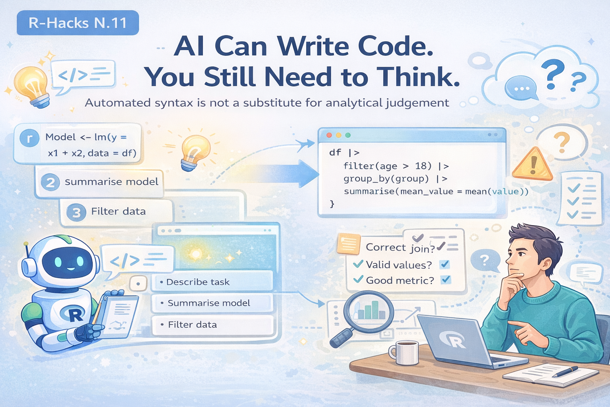

 

{width="80%" fig-align="center"
fig-alt="ChatGPT generated image"}

<iframe width="560" height="315" src="https://www.youtube.com/embed/vEd-LqBCONg?si=W5b84FMPmzwOB3LQ&amp;clip=UgkxXwAuTUH6LhA9JOfdYt5aXwaVaFZevp-L&amp;clipt=ENzSARjzxwI" title="YouTube video player" frameborder="0" allow="accelerometer; autoplay; clipboard-write; encrypted-media; gyroscope; picture-in-picture; web-share" referrerpolicy="strict-origin-when-cross-origin" allowfullscreen></iframe>

Recently, NVIDIA’s CEO Jensen Huang made a striking statement:

[*“The new programming language is English.”*]{.underline}

The idea is simple. With AI tools, many people no longer need to write
every line of code. They describe what they want, and the system
produces the implementation.

::: callout-note
This changes how we write code. It does not change the need to
understand data.
:::

The real shift is not from R to Python, or from coding to prompting — it is from syntax skills to analytical judgement.

## 1️⃣ What AI Actually Changes

AI reduces the friction of writing code.

Instead of:

`model <- lm(y ~ x1 + x2, data = df)`

`summary(model)`

You can now describe:

`“Fit a linear model with these variables and summarise it”`

And obtain a working result.

This is powerful. It lowers the barrier to entry and speeds up
experimentation.

But something important remains unchanged: AI produces code, it does not validate reasoning.

## 2️⃣ What AI Does Not Automatically Do

AI does not naturally question:

-   whether your variables are appropriate
-   whether your data contains errors
-   whether joins were correct
-   whether filtering removed critical observations
-   whether assumptions are valid

For example:

`df |> filter(age > 18)`

`|> group_by(group)`

`|> summarise(mean_value = mean(value))`

This may run perfectly.

But AI will not automatically ask:

-   Should age be filtered this way?
-   Are missing values handled?
-   Are groups balanced?
-   Is the mean the right metric?

These are analytical decisions.

## 3️⃣ The Skills That Become More Important

If AI makes syntax easier, other skills become more valuable.

Not:

-   memorising functions
-   writing boilerplate code

But:

-   asking better questions
-   checking assumptions
-   validating data structure
-   interpreting results
-   explaining findings clearly

In other words:

::: callout-tip
AI reduces the cost of coding.

It increases the value of thinking.
:::

This is why small habits — like the ones in the R-Hacks series — matter
more, not less.

## 4️⃣ Where R Still Fits

R remains particularly strong as a thinking environment.

Not just because of syntax, but because of workflow design:

-   fast exploration
-   transparent modeling
-   reproducible reports
-   readable transformations
-   strong statistical foundations

R encourages analysts to:

-   inspect
-   question
-   iterate
-   document

These are reasoning activities, not just coding tasks.

## The Practical Conclusion

AI is changing how we write code.

But it is not replacing:

-   understanding data
-   analytical judgement
-   statistical reasoning
-   careful validation

Those skills are becoming more important, not less.

::: {.callout-note appearance="simple"}
**In Short**

-   AI makes coding easier
-   AI does not replace analytical thinking
-   Understanding data remains essential
-   Good workflows matter more than syntax
-   Tools change. Reasoning remains.
:::

Programming may become easier to start.

But good analysis will always depend on understanding what the code is
actually doing.

 

::: callout-tip
If you want to stay up to date with the latest events and posts from the
Rome R Users Group:

👉 https://www.meetup.com/rome-r-users-group/
:::
