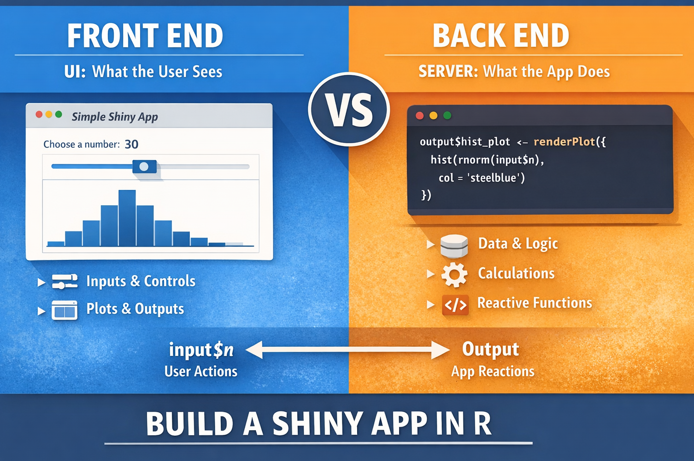

<br>


{width="80%" fig-align="center" fig-alt="ChatGPT generated image"}

Many people think a Shiny app is something complicated.

In practice, a simple Shiny app starts with a very clear idea:

:::{.callout-note}

A Shiny app has two main parts:

	- the front end, which is what the user sees
	- the back end, which is the logic that makes the app respond

:::

Once you understand this separation, building a simple app becomes much easier.
This issue of R-Hacks shows a minimal example and a few suggestions to help you think clearly about how a Shiny app works.

## 1️⃣ The Basic Structure of a Shiny App

A Shiny app usually has three main pieces:

	- a user interface
	- a server function
	- a call to shinyApp()
```{r}
library(shiny)

ui <- fluidPage(
  titlePanel("Simple Shiny App"),
  sliderInput("n", "Choose a number:", min = 10, max = 100, value = 30),
  plotOutput("hist_plot")
)

server <- function(input, output) {
  output$hist_plot <- renderPlot({
    hist(rnorm(input$n),
         col = "steelblue",
         main = "Random normal data")
  })
}

shinyApp(ui = ui, server = server)
```


This small example is enough to understand the main logic of many apps.

## 2️⃣ What the Front End Does

The front end is the part the user interacts with.

It includes things like:

	- titles
	- buttons
	- sliders
	- text boxes
	- plots
	- tables

In the example above, the front end is:

```{r}
ui <- fluidPage(
  titlePanel("Simple Shiny App"),
  sliderInput("n", "Choose a number:", min = 10, max = 100, value = 30),
  plotOutput("hist_plot")
)
```


The key idea

The front end defines:

	- what appears on the page
	- what input the user can provide
	- where results will be displayed

It is the visible side of the app.

## 3️⃣ What the Back End Does

The back end is the logic behind the interface.

It:

	- reads user input
	- performs calculations
	- updates outputs

In the example above, the back end is:

```{r}
server <- function(input, output) {
  output$hist_plot <- renderPlot({
    hist(rnorm(input$n),
         col = "steelblue",
         main = "Random normal data")
  })
}
```


The key idea

The back end answers the question:

> "What should happen when the user changes something?"

Here, when the user moves the slider, the server uses input$n to generate new random data and redraw the histogram.

## 4️⃣ A Simple Way to Think About It

A useful mental model is:

:::{.callout-tip}
	- Front end = what the user sees and touches
	- Back end = what the app calculates and updates

:::

For example:

	- sliderInput() belongs to the front end
	- renderPlot() belongs to the back end
	- input$n connects the two

This connection is what makes the app interactive.

## 5️⃣ A Slightly More Useful Example

Here is a simple app where the user chooses the number of bins in a histogram.

```{r}


library(shiny)

ui <- fluidPage(
  titlePanel("Histogram App"),
  sidebarLayout(
    sidebarPanel(
      sliderInput("bins", "Number of bins:", min = 5, max = 50, value = 20)
    ),
    mainPanel(
      plotOutput("distPlot")
    )
  )
)

server <- function(input, output) {
  output$distPlot <- renderPlot({
    x <- faithful$eruptions
    hist(x,
         breaks = input$bins,
         col = "steelblue",
         border = "white",
         main = "Histogram of eruption durations")
  })
}

shinyApp(ui = ui, server = server)
```


This example is still simple, but it already feels like a real app.

## 6️⃣ Suggestions for Keeping a Shiny App Simple

When starting, it helps to keep a few rules in mind.

Start with one input and one output

Do not try to build everything at once.

A good first app might have:

	- one slider
	- one plot

That is enough to understand the structure.

Keep the front end clean

The interface should help the user understand what to do.

Use:

	- clear labels
	- a simple layout
	- only the controls you really need

Keep the back end focused

The server should do only what is necessary.

If the app becomes harder to read, split the logic into smaller functions.

Build step by step

Start from:

	- title
	- one input
	- one output

Then expand only after the core interaction works.

## 7️⃣ Why This Distinction Matters

Many beginners confuse interface and logic.

They add lots of buttons and controls before deciding what the app should actually do.

But a Shiny app is easier to build when you ask two separate questions:

	1.	What should the user see?
	2.	What should the app do in response?

That separation makes debugging easier and design decisions clearer.

:::{.callout-note appearance="simple"}
In Short

	- A Shiny app has a visible side and a logical side
	- The front end defines the interface
	- The back end defines the behaviour
	- input connects user actions to server logic
	- Start small: one input, one output, one clear purpose
:::

A simple app is often the best way to understand how Shiny works.

::: callout-tip
If you want to stay up to date with the latest events and posts from the Rome R Users Group:

👉 https://www.meetup.com/rome-r-users-group/
:::
