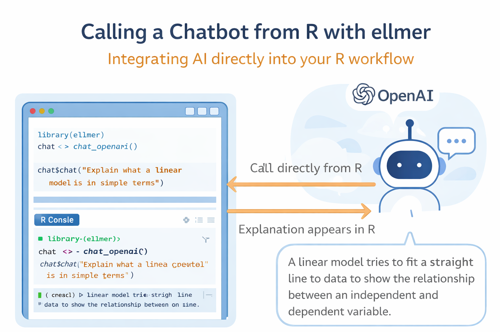

<br>

{width="80%" fig-align="center" fig-alt="ChatGPT generated image"}

Many analysts now use AI tools while working in R.

But the workflow often looks like this:

### Copy code → paste into ChatGPT → copy result → paste back into R.

This breaks reproducibility and interrupts analytical flow.

:::{.callout-note}

A better approach is simple: **Call the model directly from R.**

:::

#### Packages like `{ellmer}` make this possible with just a few lines of code.

This R-Hack shows how to make AI part of your workflow instead of a separate tool.

## 1️⃣ A Minimal ellmer Example

The simplest way to call a chat model from R looks like this:

```{r}
library(ellmer)

chat <- chat_openai()

chat$chat("Explain what a linear model is in simple terms")
```

You now have a chatbot inside your R session.

This is useful because it keeps:

- analysis  
- prompts  
- results  

in the same environment.

## 2️⃣ A Quick Comparison with Python

Many AI examples appear first in Python:

```python
from openai import OpenAI

client = OpenAI()

response = client.responses.create(
    model="gpt-4.1-mini",
    input="Explain what a linear model is"
)

print(response.output_text)
```

R can now do something very similar:

```{r}
library(ellmer)

chat <- chat_openai()

chat$chat("Explain what a linear model is")
```

The point is not R vs Python.

The real advantage is workflow:

If your data, models, and reports already live in R, calling AI from R keeps everything in one place.

## 3️⃣ A Practical Analyst Example

One useful habit is asking AI to explain model output.

For example:

```{r}
chat$chat("
Explain this model output in plain English:

Residual standard error: 2.31 on 98 degrees of freedom  
Multiple R-squared: 0.74  

Focus on interpretation, not formulas.
")
```

This can help when:

- preparing reports  
- translating technical results  
- checking interpretations  
- drafting explanations  

Treat this as a drafting assistant, not a final authority.

## 4️⃣ A Reusable Prompt Pattern

Instead of typing prompts interactively, store them:

```{r}
prompt <- "
You are a senior data analyst.

Explain this regression output for a business audience.

Rules:
- Keep explanation under 120 words
- Avoid statistical jargon
- Focus on practical meaning
"

chat$chat(prompt)
```

This improves:

- reproducibility  
- consistency  
- documentation of reasoning  

Prompts become part of your analysis pipeline.

## 5️⃣ When This Is Most Useful

Calling AI from R works especially well when you:

- document analysis steps  
- generate explanations  
- explore interpretations  
- prepare communication text  
- validate reasoning paths  

It is less useful for:

- final decisions  
- statistical validation  
- replacing domain expertise  

:::{.callout-tip}

Think of AI as a workflow accelerator, not an analytical authority.

:::

## 6️⃣ A Small Safety Rule

Always:

- review outputs critically  
- verify claims  
- check numbers manually  
- keep prompts precise  

AI performs best with clear constraints.

:::{.callout-note appearance="simple"}
In Short

- Calling AI from R avoids copy-paste workflows
- `{ellmer}` makes LLM integration simple
- AI helps explain models and draft text
- Store prompts for reproducibility
- Treat AI as assistant, not authority

:::

Small integrations like this often create the biggest workflow improvements.

::: callout-tip
If you want to stay up to date with the latest events and posts from the Rome R Users Group:

👉 <https://www.meetup.com/rome-r-users-group/>
:::
