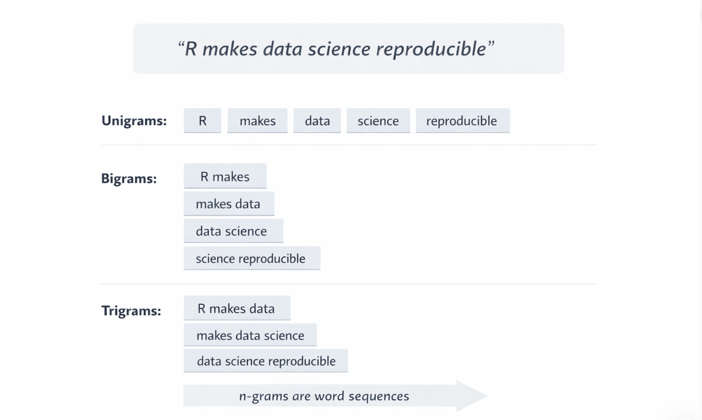

<br>

{width="80%" fig-align="center" fig-alt="ChatGPT generated image"}

Many modern AI systems can generate text, answer questions, and even write code. This often makes them feel complex or mysterious. But if we step back, the basic question behind language models is surprisingly simple: given a sequence of words,

> **"what word is likely to come next?"**

One of the earliest and simplest ways to approach this problem was through [n-grams](https://en.wikipedia.org/wiki/Word_n-gram_language_model). An n-gram is simply a sequence of *n* consecutive words extracted from text. By turning sentences into these sequences, language stops being just text and becomes something we can count, compare, and analyse.

This is why n-grams matter.

> **"They are not modern AI, but they are one of the clearest conceptual roots of language modelling."**

Before **neural networks** and **transformers**, [there were patterns of words and frequencies of occurrence]{.underline}. Understanding this small idea makes the logic of language models much less mysterious.

::: callout-note
If we know which word sequences appear frequently, we can begin to estimate which word is likely to appear next.
:::

#### In R, this idea can be explored with just a few lines of code.

## 1️⃣ A simple n-gram example in R

We can start from a very small sentence and extract single words, pairs of words, or groups of three words. This is enough to see how text becomes structured data.

```{r}
library(tidytext)
library(dplyr)
library(tidyr)
library(tibble)

text <- tibble(
  text = "R makes data science reproducible"
)

text |>
  unnest_tokens(word, text)
```

If we move from unigrams to bigrams, we start looking at pairs of consecutive words:

```{r}
text |>
  unnest_tokens(bigram, text, 
                token = "ngrams", n = 2)
```

This small change is already important. We are no longer looking at words in isolation, but at local word patterns.

## 2️⃣ From frequency to probability

Once we extract these word pairs, we can count how often they appear. That is the first step toward a language model.

```{r}
text2 <- tibble(
  text = c(
    "R makes data science reproducible",
    "R makes analysis transparent",
    "R makes data workflows easier"
  )
)

bigram_model <- text2 |>
  unnest_tokens(bigram, text, token = "ngrams", n = 2) |>
  separate(bigram, into = c("word1", "word2"), 
           sep = " ") |>
  count(word1, word2) |>
  group_by(word1) |>
  mutate(prob = n / sum(n))

bigram_model
```

At this point, we are doing something more interesting than simple counting. We are estimating the probability of seeing a second word given a first word.

That is the core transition: frequency becomes probability, and probability makes prediction possible.

## 3️⃣ A tiny next-word predictor

Now we can wrap this logic into a very small function. Given a word, it will return the most likely next word based on what it has seen in the text.

```{r}
predict_next <- function(word) {
  bigram_model |>
    filter(word1 == word) |>
    slice_max(prob, n = 1)
}

predict_next("makes")
```

This is obviously a tiny model, but conceptually it is already doing something very important: it is using observed patterns to guess what might come next.

Modern large language models do this in much more sophisticated ways, but the underlying intuition is still related to prediction from context.

## 4️⃣ What to focus on

If you only keep a few ideas from this issue, these are the ones worth remembering:

-   **Text becomes data** once we split it into word sequences that can be counted and analysed.
-   **Frequency is the starting point** because repeated sequences reveal structure in language.
-   **Probability makes prediction possible** by turning counts into likelihoods of what comes next.
-   **Modern LLMs extend the same intuition** with more advanced mathematics and much larger amounts of text.

## Final consideration

[**N-grams** are not a complete explanation of modern AI, but they are one of the simplest ways to understand how language can be modelled.]{.underline} Starting from these small building blocks makes it easier to see that language models are not magic systems. They are systems that learn patterns and use those patterns to make predictions.

In our upcoming [R-Ladies Rome session](https://www.meetup.com/rladies-rome), we will take this idea further and show in practice how a simple next-word prediction approach can be built step by step in R, and how this connects to the broader logic behind language models.

If you would like to see this built live and understand how these ideas work in practice, you can sign up for the event here:

👉 <https://www.meetup.com/rladies-rome/events/313880594>

::: {.callout-note appearance="simple"}
In Short

-   n-grams are sequences of words
-   they help turn text into structured data
-   frequencies can be converted into probabilities
-   a simple function can already guess the next word
-   this is one of the conceptual roots of language models
:::

A small idea like this often makes a much bigger system easier to understand.

::: callout-tip
If you want to stay up to date with the latest events and posts from the Rome R Users Group:

👉 <https://www.meetup.com/rome-r-users-group/>
:::

