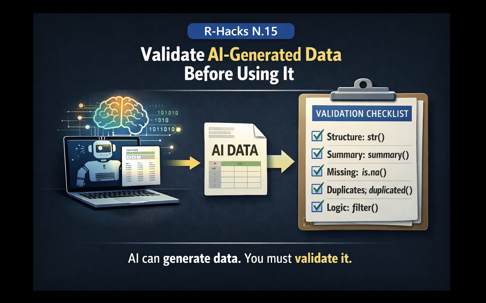

<br>

{width="80%" fig-align="center" fig-alt="ChatGPT generated image"}

AI tools can now generate data, simulate datasets, and write transformation code in seconds.

This is useful. But it introduces a new risk.

:::{.callout-note}

AI-generated data often *looks correct* even when it is not.

:::

#### The problem is not generation. It is validation.

This R-Hack introduces a simple habit: always check AI-generated data before using it in analysis.

## 1️⃣ A Typical Situation

You ask AI to generate a dataset:

```{r}
df <- data.frame(
  age = c(25, 30, 45, 52),
  income = c(20000, 35000, 50000, 62000),
  group = c("A", "A", "B", "B")
)
```

Everything looks fine.

But in real workflows, problems are often subtle:

wrong ranges
unrealistic distributions
inconsistent categories
hidden missing values

These do not always produce errors. They produce misleading results.

2️⃣ A Simple Validation Pattern

Start with basic structure checks:
```r
str(df)
summary(df)
```

3️⃣ Check for Missing and Duplicated Values
```r
colSums(is.na(df))
any(duplicated(df))
```

4️⃣ Check Logical Consistency
```r
df |> dplyr::filter(age < 0)
df |> dplyr::filter(income < 0)
```

5️⃣ A Small Reusable Habit
```r
structure → str()
summary → summary()
missing → colSums(is.na())
duplicates → duplicated()
logic → simple filters
```

:::{.callout-tip}
AI accelerates workflows.
Validation protects them.
:::

:::{.callout-note appearance=“simple”}
In Short

	•	AI-generated data may contain subtle issues
	•	structure checks reveal hidden problems
	•	missing values and duplicates must be verified
	•	logical consistency matters as much as format
	•	validation should be a standard habit
:::

::: callout-tip
If you want to stay up to date with the latest events and posts from the Rome R Users Group:

👉 https://www.meetup.com/rome-r-users-group/
:::


