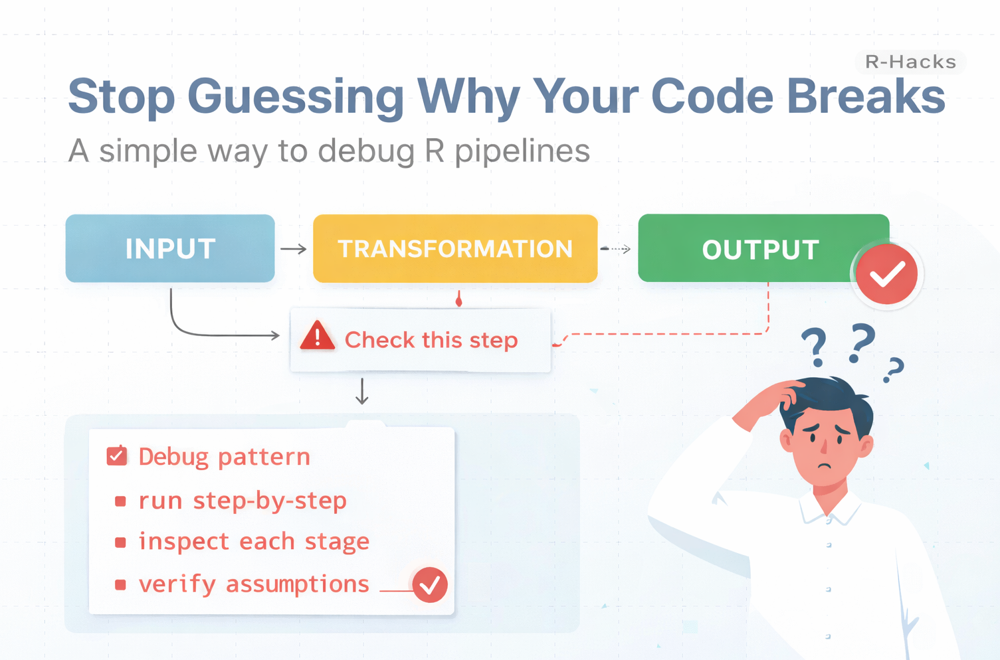

<br>

{width="80%" fig-align="center" fig-alt="ChatGPT generated image"}

AI can now generate R code in seconds.

But when that code breaks, something interesting happens.

Most people do not debug it.  
They regenerate it.

:::{.callout-note}

The problem is not the error.  
The problem is not knowing where it comes from.

:::

#### Debugging is not about fixing code. It is about locating the failure.

This R-Hack introduces a simple way to understand where things go wrong.

---

## 1️⃣ A Typical Situation

You run a pipeline:

```{r}
df |>
  dplyr::filter(value > 10) |>
  dplyr::mutate(rate = value / total) |>
  dplyr::summarise(avg = mean(rate))
```

And something fails.

You get:

- an error  
- a warning  
- or a result that does not make sense  

The usual reaction is to change the code.

But that is guessing.

---

## 2️⃣ The Structural View

Every pipeline has three parts:

- input  
- transformation  
- output  

The goal is not to fix everything at once.

The goal is to isolate where the problem appears.

:::{.callout-tip}
Instead of asking “what is wrong?”, ask:

“where does it start going wrong?”
:::

---

## 3️⃣ Break the Pipeline

Run the code step by step.

```{r}
step1 <- df |>
  dplyr::filter(value > 10)

step2 <- step1 |>
  dplyr::mutate(rate = value / total)

step3 <- step2 |>
  dplyr::summarise(avg = mean(rate))
```

Now you can inspect each stage.

---

## 4️⃣ Check Assumptions

At each step, verify what you expect:

```{r}
summary(step1)
summary(step2)
summary(step3)
```

You are checking:

- does the data look reasonable?  
- are there unexpected values?  
- did a transformation introduce problems?  

This is often enough to identify the issue.

---

## 5️⃣ A Simple Debugging Habit

Instead of rewriting code, apply a pattern:

- run pipelines step-by-step  
- store intermediate results  
- inspect outputs at each stage  
- verify assumptions before continuing  

This takes a few seconds.

But it removes guesswork.

---

## Why This Matters

AI-generated code often looks correct.

But small issues can appear:

- missing values  
- divisions by zero  
- incorrect assumptions about columns  
- unexpected data types  

If you only rerun or regenerate code, you never see where the problem started.

Debugging is not trial and error.

It is observation.

:::{.callout-note appearance="simple"}
In Short

- errors are located, not random  
- pipelines should be broken into steps  
- intermediate outputs reveal problems  
- assumptions must be verified  
- debugging is a method, not a guess
:::

AI can write code.

You still need to understand where it breaks.

::: callout-tip
If you want to stay up to date with the latest events and posts from the Rome R Users Group:

👉 https://www.meetup.com/rome-r-users-group/
:::
