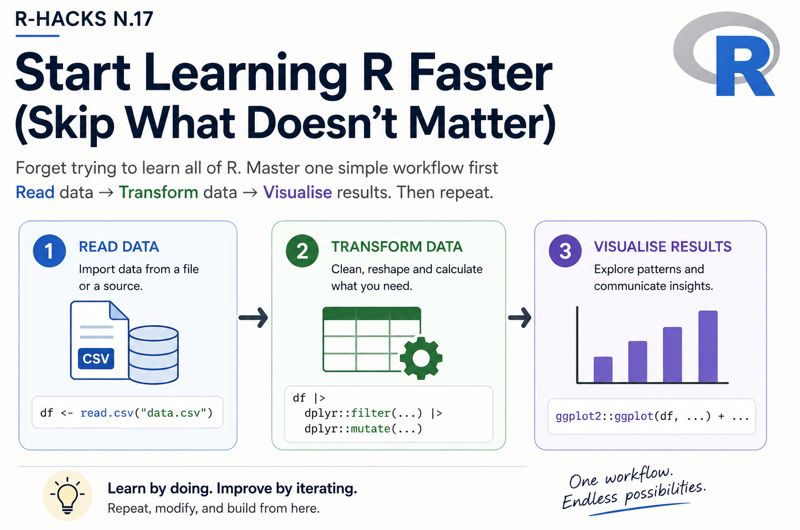
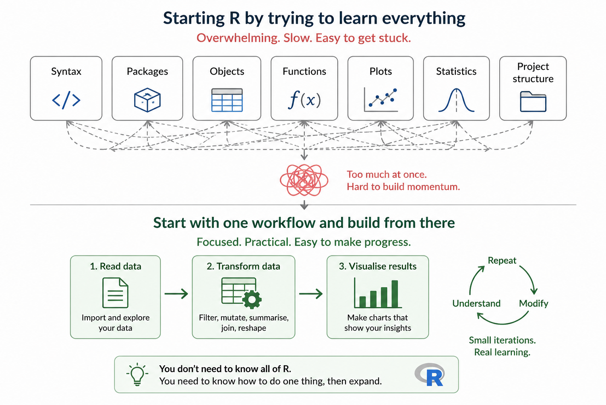
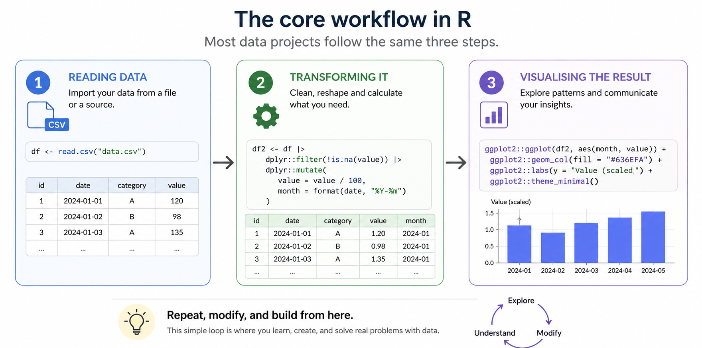
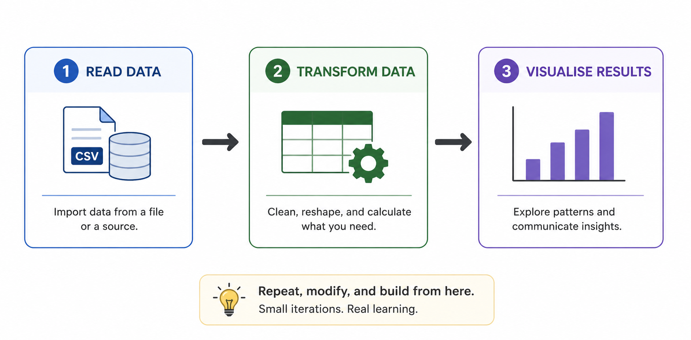

<br>

{width="80%" fig-align="center" fig-alt="ChatGPT generated image"}

Many people start learning R by trying to learn everything.



That is usually where the problem begins.

:::{.callout-note}

The fastest way to start learning R is not to learn more.

It is to learn in the right order.

:::

### Start with one small workflow, repeat it, and expand from there.

This R-Hack is about reducing friction at the beginning. Instead of trying to understand the whole R ecosystem, focus first on the part of R you are most likely to use every day: 



## 1️⃣ Start with a Workflow, Not a Language

R is a programming language, but most beginners do not need to start by learning it like a general-purpose language.

A better starting point is to think in terms of one repeatable analytical workflow:



This is the core pattern behind many R projects.

Once this pattern makes sense, the rest becomes easier to place.

## 2️⃣ Use One Small Dataset

Do not begin with a large or messy dataset.

Start with something small enough to understand by looking at it.

```{r}
df <- data.frame(
  group = c("A", "A", "B", "B"),
  value = c(10, 15, 20, 25)
)

df
```

This is enough to practise the basic workflow.

The goal is not realism yet.

The goal is confidence.

## 3️⃣ Transform the Data

Once the data is visible, apply one simple transformation.

```{r}
library(dplyr)

df_summary <- df |>
  group_by(group) |>
  summarise(mean_value = mean(value))

df_summary
```

This teaches an important idea without too much noise: data can be grouped, summarised, and turned into something more informative.

You do not need to understand every part of R before this becomes useful.

## 4️⃣ Visualise the Result

Now turn the small summary into a simple plot.

```{r}
library(ggplot2)

ggplot(df_summary, aes(x = group, y = mean_value)) +
  geom_col() +
  theme_minimal()
```

This closes the loop.

You started with data, changed it, and produced a result that can be read visually.

That is already a real analytical workflow.

## 5️⃣ Repeat Before Expanding

The real learning happens when you repeat the same structure with small changes.

Change the dataset.

Change the grouping variable.

Change the summary.

Change the plot.

This is better than jumping immediately to many packages or advanced syntax.

:::{.callout-tip}

Learn one workflow first.

Then make it slightly more complex.

:::

## Why This Matters

R becomes easier when you stop treating it as a list of things to memorise.

You do not need to know every function before starting.

You need to understand the shape of the work.

Most practical R analysis follows a simple rhythm: get data in, make it usable, extract something meaningful, and communicate it clearly.

That is the rhythm to learn first.

:::{.callout-note appearance="simple"}
In Short

- Do not start by learning everything
- Start with one repeatable workflow
- Use a small dataset first
- Practise reading, transforming, and visualising
- Expand only after the core pattern feels natural
:::

Learning R faster is often about removing what does not matter yet.

::: callout-tip
If you want to stay up to date with the latest events and posts from the Rome R Users Group:

👉 https://www.meetup.com/rome-r-users-group/
:::
