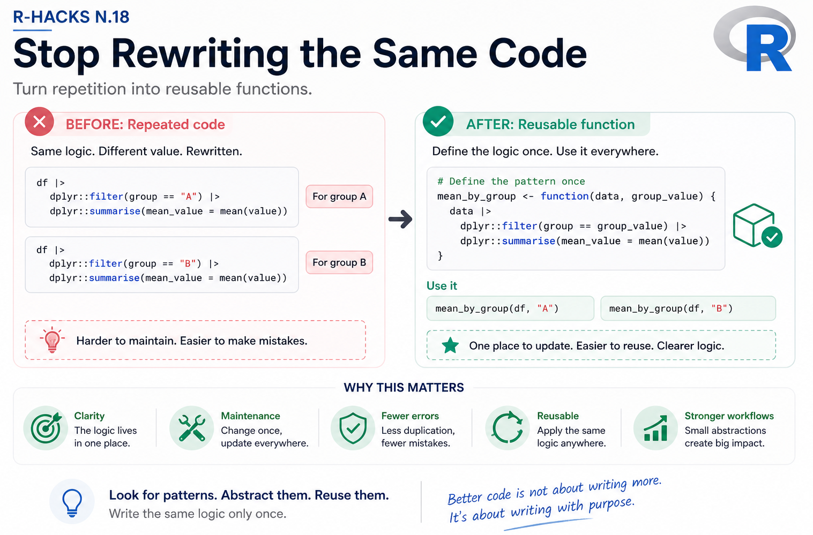

<br>

{width="80%" fig-align="center" fig-alt="ChatGPT generated image"}


Most R code does not fail because it is complex.

It fails because it is repeated.

The same pattern appears again and again: filter, transform, summarise, plot.

Each time slightly modified. Each time rewritten.

::: callout-note
Repetition is not a problem. Uncontrolled repetition is.
:::

This R-Hack is about recognising patterns and turning them into reusable pieces.


## 1️⃣ A Familiar Pattern

You start with something like this:

```{r}
df |> 
  dplyr::filter(group == "A") |> 
  dplyr::summarise(mean_value = mean(value))

df |> 
  dplyr::filter(group == "B") |> 
  dplyr::summarise(mean_value = mean(value))
```

It works.

But the structure is duplicated.


## 2️⃣ The Hidden Pattern

Look at what changes:

-   the data stays the same
-   the transformation stays the same
-   only one value changes

This is not two analyses.

It is one pattern applied twice.


## 3️⃣ Turn It Into a Function

Instead of repeating the code, capture the pattern:

```{r}
mean_by_group <- function(data, group_value) {
  data |> 
    dplyr::filter(group == group_value) |> 
    dplyr::summarise(mean_value = mean(value))
}
```

Now the logic is defined once.

Use it:

```{r}
mean_by_group(df, "A")
mean_by_group(df, "B")
```


## 4️⃣ Why This Matters

This is not about saving lines of code.

It is about clarity.

-   the logic lives in one place
-   changes are easier to manage
-   errors are easier to detect
-   workflows become easier to reuse

And importantly:

::: callout-tip
Reusable code is easier to reason about than duplicated code.
:::


## 5️⃣ A Small Habit

When you see yourself copying code:

Pause.

Ask:

> What is changing? What is staying the same?

If the structure is stable, turn it into a function.


## Why This Matters

AI makes it easier to generate code quickly.

But it also makes it easier to generate slightly different versions of the same code.

Without structure, this leads to fragmentation.

With small reusable functions, it becomes a workflow.

::: {.callout-note appearance="“simple”"}

In Short

-   repeated code often hides a pattern
-   patterns can be turned into functions
-   functions reduce duplication
-   reusable code improves clarity
-   small abstractions make workflows stronger

:::


Writing less code is not the goal.

Writing the same logic only once is.

::: {.callout-tip}

If you want to stay up to date with the latest events and posts from the Rome R Users Group:

👉 https://www.meetup.com/rome-r-users-group/


:::
