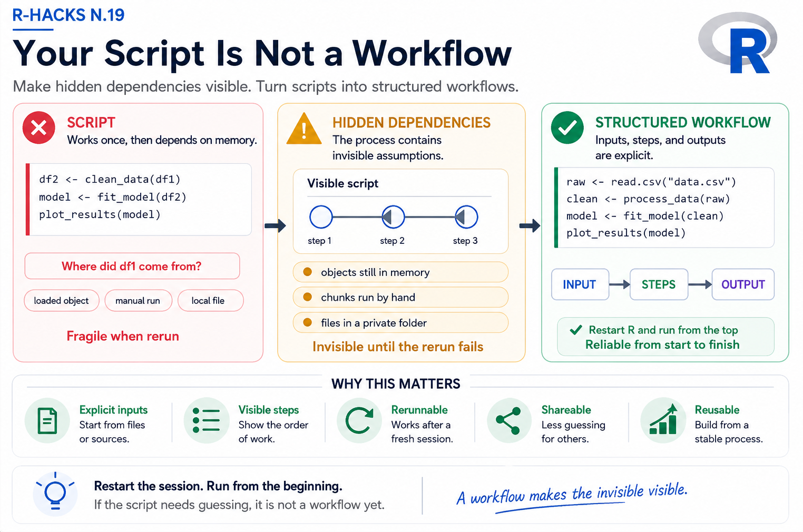

<br>

{width="80%" fig-align="center" fig-alt="ChatGPT generated image"}

Most R scripts work once.

The real problem appears when you try to run them again.

Maybe the objects are still loaded in memory. Maybe one chunk was executed manually before another. Maybe a transformation depended on something created earlier in the session and quietly forgotten afterward.

At first, everything still looks fine.

Then one day the script stops working, and it becomes difficult to understand why.

:::{.callout-note}

A script is not automatically a workflow.

:::

#### A workflow is something that can be rerun reliably from beginning to end.

This R-Hack is about the small structural difference between code that “works on your machine” and code that can actually be reused.

## 1️⃣ A Familiar Situation

A script often starts in a very natural way:

```{r}
df2 <- clean_data(df1)

model <- fit_model(df2)

plot_results(model)
```

The code itself may be correct.

But there is a hidden problem:

Where does `df1` come from?

If the session is restarted, or the environment is cleared, the script may fail immediately because one piece depends on something created somewhere else.

This is one of the most common sources of fragile analysis.

## 2️⃣ Hidden Dependencies

Many scripts quietly depend on:

- objects stored in memory
- chunks executed manually
- files placed in specific folders
- variables created interactively

The difficulty is that these dependencies are often invisible while you are working.

The script feels complete, but the process is not.

That is why code can work perfectly one day and fail the next.

## 3️⃣ A Workflow Starts from Inputs

A more reliable structure begins by making inputs explicit.

```{r}
raw_data <- read.csv("data.csv")

clean_data <- process_data(raw_data)

model <- fit_model(clean_data)

plot_results(model)
```

Now the sequence is easier to follow.

The script starts from a clear source, performs transformations in order, and produces outputs that can be reproduced later.

The important shift is not technical.

It is structural.

## 4️⃣ Why This Matters

A workflow reduces uncertainty.

Instead of relying on memory or manual execution, the analysis becomes something that can be restarted and rerun consistently.

This matters even more now because AI tools can generate code quickly. It is easy to accumulate scripts that appear functional but contain hidden assumptions and invisible dependencies.

Without structure, workflows become fragile.

With structure, they become reusable.

:::{.callout-tip}

Reproducibility starts before Quarto, Git, or pipelines.

It starts with structure.

:::

## 5️⃣ A Small Habit

Before considering a script “finished,” try one simple test:

Restart the R session and run the script from the beginning.

If it fails, the workflow probably depends on something hidden.

That small check often reveals more than reading the code itself.

## Why This Matters

A workflow is not defined by how much code it contains.

It is defined by whether another person — or even your future self — can run it again without guessing what happened before.

That is the difference between isolated code and a reusable analytical process.

:::{.callout-note appearance="simple"}
In Short

- scripts often contain hidden dependencies
- workflows make inputs and steps explicit
- reproducibility depends on structure
- restarting the session is a useful test
- reliable workflows reduce uncertainty
:::

Good workflows are not built by accident.

They are built by making dependencies visible.

::: callout-tip
If you want to stay up to date with the latest events and posts from the Rome R Users Group:

👉 https://www.meetup.com/rome-r-users-group/
:::
