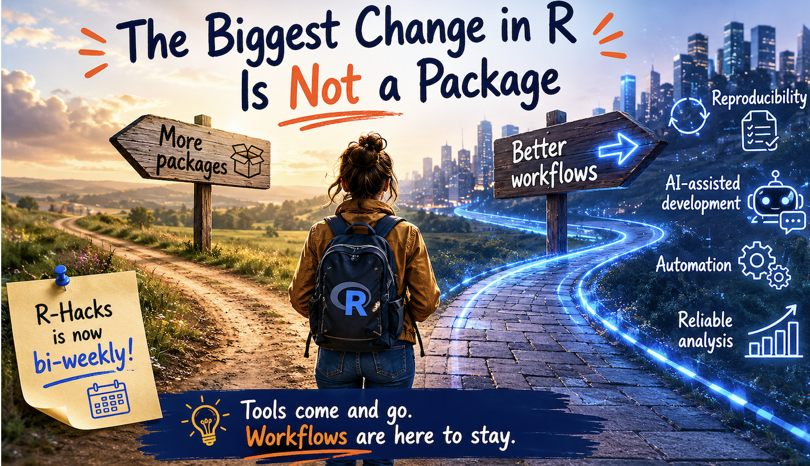

 

{width="80%" fig-align="center" fig-alt="ChatGPT generated image"}

Starting from this issue, R-Hacks moves to a bi-weekly format.

The goal is not simply to publish less often. It is to create a little more space to observe what is changing across the R ecosystem and what those changes mean for everyday analytical work.

When we look at R news, it is easy to focus on the visible layer: new packages, new releases, new tools, new integrations.

But sometimes the most important change is not a package.

:::{.callout-note}

The biggest shift in R is the move from isolated scripts to structured analytical workflows.

:::

#### The tools are changing, but the deeper change is how we organise the work.

## 1️⃣ The News Is Not Just About Tools

Recent discussions across the R ecosystem often mention AI-assisted coding, smarter development environments, reproducibility, workflow automation, and the continuous growth of packages.

The problem is no longer only how to write code. The problem is how to organise analysis so that it can be repeated, trusted, shared, and extended.

That is a workflow problem.

## 2️⃣ More Packages Are Not Always the Answer

R users have access to an extraordinary package ecosystem. This is one of R’s greatest strengths. But abundance also creates a challenge. 

When there is a package for almost everything, the question becomes less about what is available and more about what is useful for the workflow in front of you.

A new package is valuable when it removes friction from a process you already understand.

It is less useful when it adds another layer of complexity before the problem is clear.

## 3️⃣ AI Makes Structure More Important

AI tools make it easier to generate code quickly.

This is useful, but it also changes the risk. It becomes easier to accumulate code before the workflow is fully understood.

A script may look complete, but still depend on hidden assumptions, missing inputs, unclear steps, or fragile sequencing.

The faster code is produced, the more important structure becomes.

:::{.callout-tip}

When code becomes easier to generate, workflows become more important to design.

:::

## 4️⃣ The Practical Question

When you see a new package, tool, or feature, the first question should not be:

> What can this do?

A better question is:

> What friction in my workflow does this remove?

This small shift helps filter noise.

It keeps the focus on the analytical process rather than on the novelty of the tool.

## 5️⃣ A Small Habit

Before adopting a new tool, pause and describe your workflow in plain language.

What is the input?  
What transformation is needed?  
What output should be produced?  
What part currently creates friction?

If the tool helps with that friction, it may be useful.

If not, it may simply be another thing to learn.

## Why This Matters

The R ecosystem will continue to change. New packages will appear, development tools will improve, and AI-assisted workflows will become more common.

But the durable skill is not chasing every new release.

The durable skill is understanding how tools fit into an analytical workflow.

That is what makes work reproducible, reusable, and easier to maintain.

:::{.callout-note appearance="simple"}
In Short

- R-Hacks is now bi-weekly
- the R ecosystem is increasingly workflow-focused
- new packages are useful only when they remove real friction
- AI makes structure more important, not less
- the key question is what improves the workflow
:::

The biggest change in R is not a package.

It is the growing importance of building reliable analytical workflows.

::: callout-tip
If you want to stay up to date with the latest events and posts from the Rome R Users Group:

👉 https://www.meetup.com/rome-r-users-group/
:::
